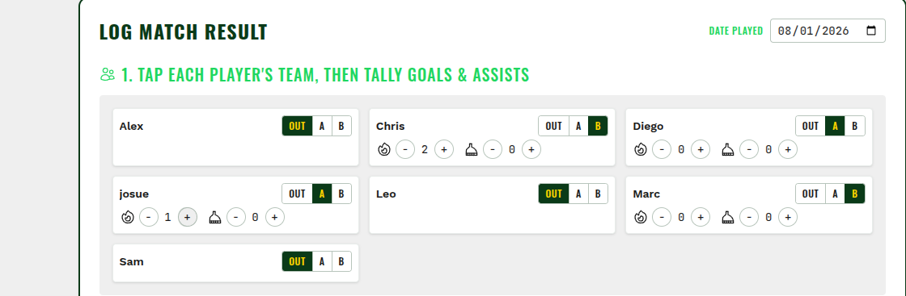
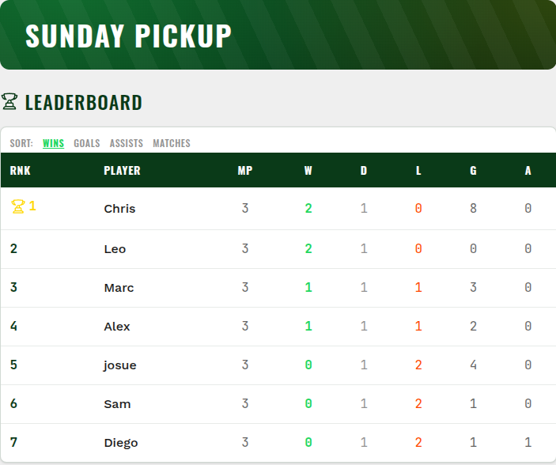
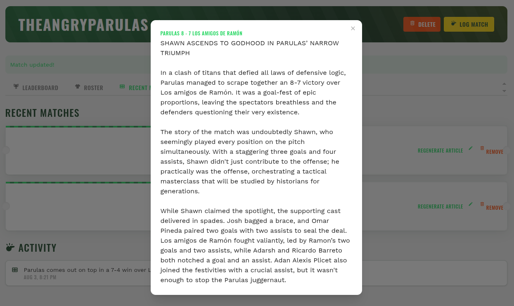
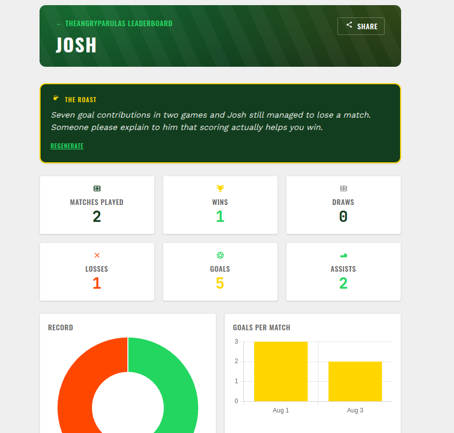

# Soccer Stats (Nutmeg)

[](https://go.dev)
[](LICENSE)
[](https://www.postgresql.org)
[](https://www.docker.com)
[](https://github.com/josuebrunel/nutmeg/actions/workflows/build-and-push.yml)

A self-hosted stats tracker for pickup soccer groups, with an AI sports desk that writes your group's trash talk for you.

Log a match in under a minute, keep an unarguable leaderboard, and let a local or cloud LLM turn every game into a fake sports headline and every player into a roast target. One `docker compose up` and it's running.

---

## What It Looks Like

**Log a match in one minute, one-handed.** Tap each player onto a team, tap `+` every time they score or assist, the final score fills itself in. No dropdowns, no typing a score into a box.



**A leaderboard that argues back.** Ranked by performance score, not just who's played the most, so a great record in a few games outranks a mediocre one spread across many. Public link, no account needed to check it.



**Every match gets a fake headline.** Click any logged game and an LLM writes a satirical sports-desk recap, built strictly from the real score, scorers, and assisters - never invented.



**Every player gets roasted, on the numbers.** A savage-but-friendly one-liner regenerated after every match, grounded strictly in that player's real stats.



---

## Features

- **Group-based organisation** - each group runs independently, with its own roster, matches, and leaderboard.
- **Role-based access** - admins manage members and settings; everyone else views and plays.
- **One-minute match logging** - tap-to-assign teams, live goal/assist steppers, auto-calculated score, editable match date shown in each visitor's own timezone.
- **Public links, no account required** - group leaderboards, player profiles, and match reports are all shareable, read-only links.
- **Performance-ranked leaderboard** - ranked by (3×Wins + Draws + Goals + Assists) ÷ Matches once a player's played enough games to qualify (3+), so ratio beats raw volume without a single lucky win topping the board.
- **AI player roasts** - a one-line, savage-but-friendly roast per player, regenerated after every match, built only from real stats, no invented events, ever.
- **AI-powered News feed** - a full satirical match report (headline included) for every match, and a signing-style blurb for every new player, public and readable from each group's page, no account required.
- **Pluggable LLM backend** - local Ollama by default, or Google's Generative Language API, switchable via one env var. All generation runs as a background job so a slow or unreachable model never blocks logging a match.
- Group CRUD, member management (add/remove, CSV import, promote/demote, inline edit), public request-to-join with admin approval
- Global stats dashboard, responsive sidebar layout, flash messages, HTMX-powered interactions throughout
- Docker Compose for local dev, hot-reload workflow with Air + Templ

---

## Tech Stack

| Layer              | Technology                                                                                                                                       |
| ------------------ | ------------------------------------------------------------------------------------------------------------------------------------------------ |
| **Language**       | Go 1.25+                                                                                                                                         |
| **Web Framework**  | [Echo v5](https://github.com/labstack/echo/v5)                                                                                                   |
| **Templates**      | [Templ](https://github.com/a-h/templ) (type-safe HTML templates)                                                                                 |
| **Frontend**       | [HTMX 2.x](https://htmx.org), [DaisyUI 5](https://daisyui.com), [Tailwind CSS 4](https://tailwindcss.com), [Chart.js 4](https://www.chartjs.org) |
| **Database**       | PostgreSQL 17 (via [pgx](https://github.com/jackc/pgx/v5))                                                                                       |
| **Query Builder**  | [Bob](https://github.com/stephenafamo/bob) + [scan.StructMapper](https://github.com/stephenafamo/scan)                                           |
| **Migrations**     | [Goose v3](https://github.com/pressly/goose/v3) (embedded, no global registry)                                                                   |
| **Background Jobs**| [RiverQueue](https://github.com/riverqueue/river) (Postgres-backed job queue, e.g. async AI commentary generation)                               |
| **AI / LLM**       | Pluggable via `LLM_PROVIDER` — [Ollama](https://ollama.com) (local inference, default) or [Google's Generative Language API](https://ai.google.dev/gemini-api/docs/models) (e.g. Gemma), both hand-rolled clients in `internal/llm/`, no SDK — powers player roasts and the group News feed (match reports, player-signing blurbs) |
| **Authentication** | [Ezauth](https://github.com/josuebrunel/ezauth)                                                                                                  |
| **Configuration**  | [Xenv](https://github.com/josuebrunel/gopkg/xenv)                                                                                                |
| **Hot Reload**     | [Air](https://github.com/air-verse/air)                                                                                                          |

## Architecture

The application follows a clean **layered architecture** within the `internal/` package:

```
┌─────────────────────────────────────────────────────┐
│                     Router                          │
│           (internal/router/router.go)                │
├─────────────────────────────────────────────────────┤
│                   Handler                           │
│  (internal/handler/) — HTTP handlers, parsing,      │
│   flash messages, form validation, layout wiring    │
├─────────────────────────────────────────────────────┤
│                   Service                           │
│  (internal/service/) — business logic, authorisation│
│   checks, orchestration of repository calls         │
├─────────────────────────────────────────────────────┤
│                  Repository                         │
│  (internal/repository/) — SQL queries via Bob ORM   │
│   (psql dialect), data access layer                 │
├─────────────────────────────────────────────────────┤
│                     Model                           │
│  (internal/model/) — domain structs with db tags    │
├─────────────────────────────────────────────────────┤
│                   Database                          │
│  (internal/database/) — pgx pool open, Goose        │
│   migrations                                        │
├─────────────────────────────────────────────────────┤
│                   Views (Templ)                     │
│  (views/) — type-safe HTML templates, layout,       │
│   page components, SVG icons                        │
└─────────────────────────────────────────────────────┘
```

### Entity flow (example: Group)

```
Model → Repository → Service → Handler → Templ View → Route
```

Every entity follows the same convention: one file each for model, repository operations, service logic, handler methods, and views (list, form, detail).

### Authentication

- **Ezauth** handles all auth concerns: registration, login, logout, session middleware, and login-required middleware.
- `SessionMiddleware` is applied globally to the Echo instance.
- `LoginRequiredMiddleware` is applied only to the authenticated app group (not the `/auth/*` routes).
- Users table is managed by Ezauth in the `auth` schema.

## Database Schema

The database contains ten core tables:

| Table                  | Description                                                                                          |
| ---------------------- | ----------------------------------------------------------------------------------------------------- |
| `groups`               | Soccer groups; each group has a name, optional description, and creator                                |
| `group_players`        | Named players belonging to a group (not tied to a user account); includes role (`admin` or `member`), optional phone/email |
| `teams`                | Teams within a group; each team has a name and optional colour                                         |
| `matches`              | Matches between two teams; stores home/away scores, notes, and when the match was played               |
| `match_events`         | Individual events within a match (goals, assists); links to the scoring team and players                |
| `match_players`        | Roster of which players participated on which team for a given match                                   |
| `group_join_requests`  | Pending/approved/rejected requests from a user to join a group via the public join flow                 |
| `player_commentary`    | AI-generated "roast" commentary per player, one active row at a time (older rows marked `superseded`)   |
| `group_news`           | Public News feed entries — a signing-style blurb per new player, a full satirical match report per match — upgraded from a fallback to AI-generated text by a background job; match entries are regenerated in place on a new match or an admin's manual regenerate action |

Indexes cover the foreign-key columns for efficient lookups.

## Getting Started

### Prerequisites

- Go 1.25+ (CI and the Docker image build with Go 1.26)
- PostgreSQL 17 (or Docker)
- For AI player commentary: either [Ollama](https://ollama.com) running locally/reachable (default, via `LLM_BASE_URL`), or a Google Generative Language API key (set `LLM_PROVIDER=google` and `LLM_API_KEY`) — see [Configuration](#configuration)
- [Templ CLI](https://github.com/a-h/templ) — `go install github.com/a-h/templ/cmd/templ@latest`
- (Optional) [Air](https://github.com/air-verse/air) for hot reload — `go install github.com/air-verse/air@latest`

### Setup

1. **Clone the repository**

   ```bash
   git clone git@github.com:josuebrunel/nutmeg.git
   cd nutmeg
   ```

2. **Create environment file**

   ```bash
   cp .env.example .env
   ```

   Edit `.env` with your database credentials and secrets.

3. **Start the database**

   ```bash
   docker compose up -d db
   ```

4. **Run the application**

   ```bash
   make run
   ```

   This runs `templ generate`, builds the binary, and starts the server on `:8080`.

5. **Open the app**

   Visit [http://localhost:8080](http://localhost:8080) in your browser.

### Development with hot reload

```bash
make dev
```

This starts Templ's file watcher (for automatic `.templ` → `.go` generation) and Air (for automatic Go recompilation on file changes).

## Development Commands

| Command             | Description                                             |
| ------------------- | ------------------------------------------------------- |
| `make dev`          | Start hot-reload development server (Templ watch + Air) |
| `make build`        | Generate Templ code and build the binary                |
| `make run`          | Build and run the server                                |
| `make db`           | Start the PostgreSQL container only                     |
| `make docker-up`    | Build and start all Docker services                     |
| `make docker-down`  | Stop all Docker services                                |
| `make migrate`      | Run pending Goose migrations                            |
| `make migrate-down` | Roll back the last migration                            |
| `nutmeg -migrate up` / `nutmeg -migrate down` | Run/roll back migrations from the built binary (used by the production Docker image) |
| `make templ-gen`    | Regenerate Templ template code                          |
| `make swag`         | Regenerate the Swagger/OpenAPI spec in `docs/` from `@Summary`/`@Router` annotations |
| `make test`         | Run all tests (sequential, single-run)                  |
| `make clean`        | Remove build artifacts and generated files              |

## Project Structure

```
.
├── .air.toml                    # Air hot-reload configuration
├── .env.example                 # Environment variable template
├── .env                         # Environment variables (git-ignored)
├── Dockerfile                   # Multi-stage Docker build
├── docker-compose.yml           # PostgreSQL + app services
├── Makefile                     # Development commands
├── go.mod / go.sum              # Go module dependencies
├── cmd/server/main.go           # Application entry point
├── docs/                        # swaggo-generated OpenAPI spec (regenerate via `make swag`)
├── internal/
│   ├── assert/                  # Test assertion helpers
│   ├── config/                  # Environment-based configuration
│   ├── database/                # Database connection + migrations
│   ├── handler/                 # HTTP handlers (auth, account, group, home, match)
│   │   └── api/                 # JSON API handlers (/api/v1), swaggo-annotated
│   ├── llm/                     # Ollama + Google LLM clients (pluggable via LLM_PROVIDER)
│   ├── middleware/               # Auth + timezone middleware
│   ├── model/                   # Domain structs with db tags
│   ├── render/                  # Templ rendering helpers
│   ├── repository/              # Data access layer (Bob psql queries)
│   ├── router/                  # Route registration
│   ├── service/                 # Business logic layer
│   └── worker/                  # RiverQueue background jobs (player roasts, group news)
├── migrations/                  # SQL migration files (embedded)
├── static/css/                  # Static assets (CSS)
├── views/
│   ├── components/              # Reusable Templ components (icons)
│   ├── layout/                  # Base layout with sidebar
│   └── pages/                   # Page-specific templates
│       ├── account/             # Account settings
│       ├── auth/                # Login, Register
│       ├── groups/               # List, Form, Detail, Leaderboard, News feed, match report
│       ├── home/                # Dashboard, Stats
│       ├── matches/              # Match logging/edit modal
│       ├── players/              # Player profile + AI commentary
│       └── stats, teams/         # Currently empty (no dedicated views yet)
```

## API Routes

Authenticated routes are registered in `internal/router/router.go`; public routes are wired directly in `cmd/server/main.go`.

### Public (no login required)

| Method | Path                             | Handler                 | Description                          |
| ------ | -------------------------------- | ------------------------ | ------------------------------------- |
| `GET`  | `/`                               | Home.Landing             | Landing page                          |
| `GET`  | `/login`                         | Auth.Login               | Login page                            |
| `GET`  | `/register`                      | Auth.Register            | Registration page                     |
| `GET`  | `/help`                          | Home.Help                | How-it-works / user guide page        |
| `GET`  | `/health`                        | —                        | Health check                          |
| `GET`  | `/groups/:id/leaderboard`        | Group.PublicLeaderboard  | Public, read-only group leaderboard   |
| `GET`  | `/groups/:id/players/:memberId`  | Group.PlayerProfile      | Public player profile + AI commentary |
| `GET`  | `/groups/:id/matches/:mid`       | Group.PublicMatchReport  | Public match report (HTMX fragment for in-page clicks, full page with social-preview meta tags for direct/shared links) |

Auth routes (`/auth/*`) are handled by Ezauth automatically and include login, register, logout, and callback endpoints.

### Authenticated

| Method   | Path                                                   | Handler                    | Description                                          |
| -------- | ------------------------------------------------------- | ---------------------------- | ------------------------------------------------------ |
| `GET`    | `/dashboard`                                             | Home.Dashboard              | Post-login dashboard                                 |
| `GET`    | `/stats`                                                 | Home.Stats                  | Global stats dashboard                               |
| `GET`    | `/account`                                               | Account.Edit                | Account settings form                                |
| `POST`   | `/account`                                               | Account.Update              | Update name/username/email                           |
| `POST`   | `/account/password`                                      | Account.UpdatePassword      | Change password                                      |
| `GET`    | `/groups`                                                | Group.Index                 | List user's groups                                   |
| `GET`    | `/groups/new`                                            | Group.New                   | New group form                                       |
| `POST`   | `/groups`                                                | Group.Create                | Create a group                                       |
| `GET`    | `/groups/:id`                                            | Group.Detail                | Group details + members                              |
| `GET`    | `/groups/:id/edit`                                       | Group.Edit                  | Edit group form                                      |
| `POST`   | `/groups/:id`                                            | Group.Update                | Update a group                                       |
| `DELETE` | `/groups/:id`                                            | Group.Delete                | Delete a group                                       |
| `GET`    | `/groups/:id/detail-content`                             | Group.DetailContent         | HTMX partial refresh of group detail                 |
| `GET`    | `/groups/:id/leaderboard-full`                           | Group.LeaderboardFull       | Full (non-truncated) leaderboard                     |
| `GET`    | `/groups/:id/roster-full`                                | Group.RosterFull            | Full (non-truncated) roster                          |
| `GET`    | `/groups/:id/matches-full`                               | Group.MatchesFull           | Full (non-truncated) match history                   |
| `POST`   | `/groups/:id/members`                                    | Group.AddMember             | Add member(s), comma-separated                       |
| `POST`   | `/groups/:id/members/import`                             | Group.ImportMembers         | Bulk CSV roster import                               |
| `DELETE` | `/groups/:id/members/:memberId`                          | Group.RemoveMember          | Remove a member                                      |
| `GET`    | `/groups/:id/members/:memberId/edit`                     | Group.EditMemberForm        | Inline edit form (name/phone/email)                  |
| `POST`   | `/groups/:id/members/:memberId`                          | Group.UpdateMember          | Update a member's name/phone/email                   |
| `POST`   | `/groups/:id/members/:memberId/promote`                  | Group.PromoteMember         | Promote member to admin                              |
| `POST`   | `/groups/:id/members/:memberId/demote`                   | Group.DemoteMember          | Demote admin to member                               |
| `POST`   | `/groups/:id/join-requests`                              | Group.RequestJoin           | Submit a request to join the group                   |
| `POST`   | `/groups/:id/join-requests/:reqId/approve`               | Group.ApproveJoinRequest    | Approve a join request                               |
| `POST`   | `/groups/:id/join-requests/:reqId/reject`                | Group.RejectJoinRequest     | Reject a join request                                |
| `POST`   | `/groups/:id/players/:memberId/regenerate-commentary`    | Group.RegenerateCommentary  | Manually regenerate AI commentary (cooldown-limited) |
| `POST`   | `/groups/:id/matches/:mid/regenerate-article`            | Group.RegenerateMatchReport | Manually regenerate a match's AI report (cooldown-limited) |
| `GET`    | `/groups/:id/match-modal`                                | Match.LogMatchModal         | Match logging modal                                  |
| `POST`   | `/groups/:id/matches`                                    | Match.Create                | Log a new match                                      |
| `GET`    | `/groups/:id/matches/:mid/edit`                          | Match.EditModal             | Match edit modal                                     |
| `POST`   | `/groups/:id/matches/:mid/update`                        | Match.Update                | Update a logged match                                |
| `DELETE` | `/groups/:id/matches/:mid`                               | Match.Delete                | Delete a match                                       |

### JSON API (`/api/v1`)

A full CRUD JSON mirror of the authenticated routes above, plus a small public read-only surface, documented with Swagger/OpenAPI (swaggo, code-first annotations). Registered in `internal/router/api.go`, handlers live in `internal/handler/api/`.

Authenticated via ezauth's JWT Bearer flow — obtain a token from `POST /auth/api/login`, then send `Authorization: Bearer <access_token>` on every `/api/v1/*` request. Interactive docs (Swagger UI) are served at `/swagger/index.html`; the raw spec is at `docs/swagger.json` / `docs/swagger.yaml`.

| Method   | Path                                                    | Description                          |
| -------- | -------------------------------------------------------- | ------------------------------------- |
| `GET`    | `/api/v1/dashboard`                                       | Caller's groups + global stats        |
| `GET`    | `/api/v1/stats`                                           | Caller's global stats                 |
| `GET`    | `/api/v1/account`                                         | Get account info                      |
| `PATCH`  | `/api/v1/account`                                         | Update account info                   |
| `POST`   | `/api/v1/account/password`                                | Change password                       |
| `GET`    | `/api/v1/groups`                                          | List groups                           |
| `POST`   | `/api/v1/groups`                                          | Create a group                        |
| `GET`    | `/api/v1/groups/:id`                                      | Get a group                           |
| `PATCH`  | `/api/v1/groups/:id`                                      | Update a group                        |
| `DELETE` | `/api/v1/groups/:id`                                      | Delete a group                        |
| `GET`    | `/api/v1/groups/:id/members`                              | List members                          |
| `POST`   | `/api/v1/groups/:id/members`                              | Add member(s)                         |
| `POST`   | `/api/v1/groups/:id/members/import`                       | Bulk import members                   |
| `PATCH`  | `/api/v1/groups/:id/members/:memberId`                    | Update a member                       |
| `DELETE` | `/api/v1/groups/:id/members/:memberId`                    | Remove a member                       |
| `POST`   | `/api/v1/groups/:id/members/:memberId/promote`            | Promote member to admin               |
| `POST`   | `/api/v1/groups/:id/members/:memberId/demote`             | Demote admin to member                |
| `GET`    | `/api/v1/groups/:id/join-requests`                        | List join requests                    |
| `POST`   | `/api/v1/groups/:id/join-requests`                        | Request to join the group             |
| `POST`   | `/api/v1/groups/:id/join-requests/:reqId/approve`         | Approve a join request                |
| `POST`   | `/api/v1/groups/:id/join-requests/:reqId/reject`          | Reject a join request                 |
| `GET`    | `/api/v1/groups/:id/leaderboard`                          | Group leaderboard                     |
| `POST`   | `/api/v1/groups/:id/players/:memberId/regenerate-commentary` | Regenerate AI commentary (cooldown-limited) |
| `GET`    | `/api/v1/groups/:id/matches`                              | List matches                          |
| `POST`   | `/api/v1/groups/:id/matches`                              | Log a match                           |
| `GET`    | `/api/v1/groups/:id/matches/:mid`                         | Get a match's full detail             |
| `PATCH`  | `/api/v1/groups/:id/matches/:mid`                         | Update a match                        |
| `DELETE` | `/api/v1/groups/:id/matches/:mid`                         | Delete a match                        |

Public (no auth required):

| Method | Path                                          | Description             |
| ------ | ----------------------------------------------- | ------------------------- |
| `GET`  | `/api/v1/public/groups/:id/leaderboard`        | Public group leaderboard |
| `GET`  | `/api/v1/public/groups/:id/players/:memberId`  | Public player profile    |

## Testing

Tests are written using the standard `testing` package with custom assertion helpers in `internal/assert/`.

```bash
# Run all tests
make test

# Run tests with verbose output
go test -v ./...

# Run tests for a specific package
go test -v ./internal/service/...
```

The test suite includes:
- **Service layer tests** (`internal/service/group_test.go`, `internal/service/commentary_test.go`) — group CRUD, member management, and authorisation logic, plus AI commentary generation/cooldown logic, using mock repositories.
- **Repository tests** (`internal/repository/match_test.go`) — match/goal/assist persistence against Bob queries.
- **Model tests** (`internal/model/errors_test.go`) — sentinel error comparisons.

CI also spins up a Postgres service container to run these against a real database.

## Docker

### Services

The `docker-compose.yml` defines three services:

1. **`dev`** — development container with hot reload, mounted source code
2. **`nutmeg`** — production container built from the multi-stage Dockerfile
3. **`db`** — PostgreSQL 17 Alpine

### Usage

```bash
# Development environment
docker compose up dev

# Production image
docker compose up nutmeg

# Start just the database (for local development)
docker compose up -d db
```

The application is exposed on port **8380** (mapped to container port 8080). The database is exposed on port **8381** (mapped to container port 5432).

## Configuration

All configuration is loaded from the environment (or `.env` file) using Xenv.

| Variable                       | Default                 | Description                     |
| ------------------------------ | ----------------------- | ------------------------------- |
| `ADDR`                         | `:8080`                 | Server listen address           |
| `BASE_URL`                     | `http://localhost:8080` | Base URL for redirects          |
| `DEBUG`                        | `false`                 | Enable debug mode               |
| `DB_DSN`                       | *(required)*            | PostgreSQL connection string    |
| `LLM_PROVIDER`                 | `ollama`                | LLM backend: `ollama` or `google` — same LLM_BASE_URL/LLM_API_KEY/LLM_MODEL names apply to whichever is selected |
| `LLM_BASE_URL`                 | `http://localhost:11434`| Ollama server URL (unused when `LLM_PROVIDER=google`) |
| `LLM_API_KEY`                  | *(empty)*               | Google Generative Language API key (unused when `LLM_PROVIDER=ollama`) |
| `LLM_MODEL`                    | `llama3.1:8b`           | Ollama tag or Google model id, depending on `LLM_PROVIDER` |
| `SMTP_HOST`                    | *(empty)*               | SMTP server host — leave blank to disable email sending (no-op, logged) |
| `SMTP_PORT`                    | `587`                   | SMTP server port                |
| `SMTP_USERNAME`                | *(empty)*               | SMTP auth username               |
| `SMTP_PASSWORD`                | *(empty)*               | SMTP auth password               |
| `EMAIL_FROM`                   | `noreply@nutmeg.local`  | From address for outgoing email |
| `EZAUTH_JWT_SECRET`            | *(required)*            | JWT signing secret              |
| `EZAUTH_DB_DIALECT`            | `postgres`              | Auth database dialect           |
| `EZAUTH_DB_DSN`                | *(required)*            | Auth database connection string |
| `EZAUTH_ADDR`                  | `:8080`                 | Ezauth's own listen address     |
| `EZAUTH_BASE_URL`              | `http://localhost:8080` | Ezauth's own base URL           |
| `EZAUTH_DEBUG`                 | `true`                  | Auth debug mode                 |
| `EZAUTH_REDIRECT_AFTER_LOGIN`  | `/groups`               | Post-login redirect (overridden to `/dashboard` at startup regardless of env value) |
| `EZAUTH_REDIRECT_AFTER_LOGOUT` | `/login`                | Post-logout redirect            |

## Non-Negotiable Rules

The project enforces several architectural rules (documented in `prompt.txt`):

1. **Echo v5** — handlers take `*echo.Context` (pointer); shutdown uses `StartConfig`; no `Shutdown()` method.
2. **Bob** — `bob.NewDB(*sql.DB)` returns a `bob.DB` value type, not a pointer.
3. **Goose** — use `goose.WithDisableGlobalRegistry(true)`; never use global registry functions.
4. **Ezauth** — `SessionMiddleware` on `e.Use` (global); `LoginRequiredMiddleware` only on the app group.
5. **Templ** — no `if` inside function call arguments; use `@{ }` code blocks instead.
6. **Models** — use `db` struct tags for `scan.StructMapper`.
7. **Migrations** — use `IF NOT EXISTS` / `IF EXISTS` for idempotency. Name new files `YYYYMMDDHHMMSS_description.sql` (full timestamp, not `YYYYMMDD_NNN`) — Goose derives a migration's version from the digits before the *first* underscore in the filename (see `goose.NumericComponent`), so two `YYYYMMDD_NNN` files created on the same date collide on the same 8-digit version regardless of their `NNN` suffix. The full-timestamp form is always unique to the second. Existing files aren't renamed to match, since that would change their already-applied version numbers.
8. **Router** — wire all routes in a single `Register()` function called with an `echo.Group`.
9. **Handlers** — group into sub-handlers on a top-level `Handler` struct; use `page()` helper to wrap in layout.
10. **JSON API** — lives entirely in `internal/handler/api` + `internal/router/api.go`, never mixed into the Templ/HTMX handler files; regenerate `docs/` via `make swag` after changing any `@Router`/`@Summary` annotation.

## License

This project is licensed under the MIT License — see the [LICENSE](LICENSE) file for details.